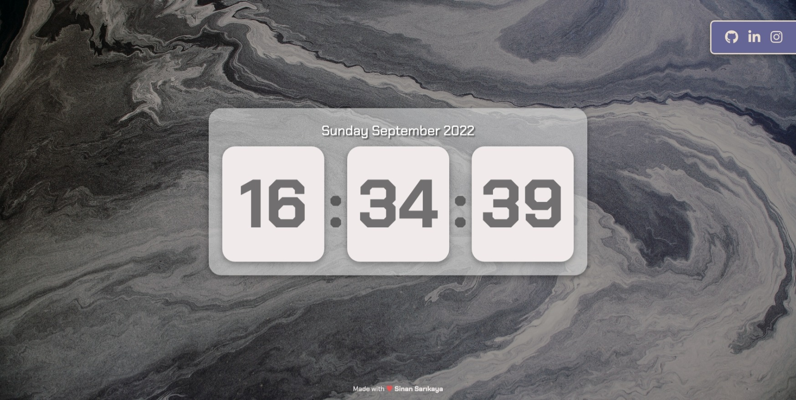

# Javascript Digital Clock


Responsive digital clock made using JavaScript

<hr />

### Installation Options

```
$ git clone https://github.com/sinansarikaya/javascript-clock.git
```

<hr />

### Demo

#### [View Demo](https://sinansarikaya.github.io/javascript-clock/)



<hr />

### Try yourself

You can try to make it yourself by looking at the design in Figma.

#### [View the design in Figma](https://www.figma.com/file/9lhfB7eKlJANMN83seQOH2/javascript-watch)
